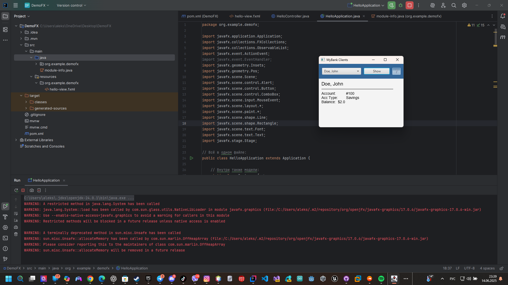

# UI Lab 5


Це одна з робіт, які доповнюють основний цикл лабораторних робіт #1-8 (проект **Banking**, [Netbeans](https://netbeans.org/)) з ООП.  Основна мета цих додаткових вправ - познайомитись з різними видами інтерфейсів користувача та засобами їх створення. Згадувані 'базові' роботи розміщено в [окремому репозиторії](https://github.com/liketaurus/OOP-JAVA) (якщо будете робити завдання на "4" або "5" раджу переглянути [діаграму класів](https://github.com/liketaurus/OOP-JAVA/blob/master/MyBank.png), аби розуміти які методи є у класів).

В ході цієї роботи вам пропонується виконати **наступне завдання** - [Робота 5: GUI з JavaFX](https://github.com/ppc-ntu-khpi/GUI-Lab3-Starter/blob/master/Lab%205%20-%20JavaFX/Lab%205.md)
  
**Додаткове завдання** (для тих хто зробив все і прагне більшого): [дивіться тут](https://github.com/ppc-ntu-khpi/GUI-Lab3-Starter/blob/master/Lab%205%20-%20JavaFX/Lab%20-%205%20-%20add.md)

Всі необхідні бібліотеки містяться у теці [jars](https://github.com/ppc-ntu-khpi/GUI-Lab3-Starter/tree/master/jars). В тому числі - всі необхідні відкомпільовані класи з робіт 1-8 - файл [MyBank.jar](https://github.com/ppc-ntu-khpi/GUI-Lab3-Starter/blob/master/jars/MyBank.jar). Файл даних лежить у теці [data](https://github.com/ppc-ntu-khpi/GUI-Lab3-Starter/tree/master/data).

---
**УВАГА! Не забуваємо здавати завдання через Google Classroom та вказувати посилання на створений для вас репозиторій!**

Також пам'ятайте, що ніхто не заважає вам редагувати файл README у вашому репозиторії😉.
А ще - дуже раджу спробувати нову фічу - інтеграцію з IDE REPL.it (хоч з таким завданням вона може й не впоратись, однак, цікаво ж!).

[](https://gitter.im/PPC-SE-2020/OOP?utm_source=badge&utm_medium=badge&utm_campaign=pr-badge)


 

# На "трійку" 
1. Завантажте jar-файл з усіма потрібними классами (*Bank, Customer, Account* та ін.) з наших попередніх лаб - [MyBank](https://github.com/ppc-ntu-khpi/GUI-Lab3-Starter/blob/master/jars/MyBank.jar) 
2. Створіть в Netbeans новий проект з назвою FxDemo (або використайте проект, створений в ході виконання попередньої роботи). *УВАГА! Чекбокс *Create Main Class* треба **очистити** (**не створювати виконуваний клас**)!* 
3. Додайте до проекту завантажену вами бібліотеку - правою кнопкой на проекті, обрати *Properties*, потім у дереві категорій обрати *Libraries* (другий пункт зверху), натиснути у правій частині вікна кнопку *Add JAR/Folder*, обрати jar-файл, завантажений у п. 1, натиснути *Ok* 
4. Додайте до проекту клас [FXDemo](https://github.com/ppc-ntu-khpi/GUI-Lab3-Starter/blob/master/Lab%205%20-%20JavaFX/FXDemo.java) з цього репозитрію.
5. Вивчіть вихідний код класу, впевніться, що ви розумієте як він має працювати 
6. Запустіть проект у звичайний спосіб. Ви маєте побачити вікно, в якому можна обрати клієнта і переглянути баланс його першого рахунку та переглянути інформацію про програму. Продемонстрируйте результат викладачеві. 

```java
package org.example.demofx;

import javafx.application.Application;
import javafx.collections.FXCollections;
import javafx.collections.ObservableList;
import javafx.event.ActionEvent;
import javafx.event.EventHandler;
import javafx.geometry.Insets;
import javafx.geometry.Pos;
import javafx.scene.Scene;
import javafx.scene.control.Alert;
import javafx.scene.control.Button;
import javafx.scene.control.ComboBox;
import javafx.scene.input.MouseEvent;
import javafx.scene.layout.*;
import javafx.scene.paint.*;
import javafx.scene.shape.Line;
import javafx.scene.shape.Rectangle;
import javafx.scene.text.Font;
import javafx.scene.text.Text;
import javafx.stage.Stage;

// Всё в одном файле:
public class HelloApplication extends Application {

    // Внутри также модели:
    static class Customer {
        private String firstName;
        private String lastName;
        private Account account;

        Customer(String firstName, String lastName, Account account) {
            this.firstName = firstName;
            this.lastName = lastName;
            this.account = account;
        }

        String getFullName(){
            return lastName + ", " + firstName;
        }

        Account getAccount(){
            return account;
        }
    }

    static abstract class Account {
        protected int accountId;
        protected double balance;

        Account(int accountId, double balance) {
            this.accountId = accountId;
            this.balance = balance;
        }

        abstract String getType();

        int getId(){
            return accountId;
        }

        double getBalance(){
            return balance;
        }
    }

    static class CheckingAccount extends Account {
        CheckingAccount(int accountId, double balance) {
            super(accountId, balance);
        }
        @Override
        String getType(){
            return "Checking";
        }
    }

    static class SavingsAccount extends Account {
        SavingsAccount(int accountId, double balance) {
            super(accountId, balance);
        }
        @Override
        String getType(){
            return "Savings";
        }
    }

    // В приложении будем иметь следующий список пользователей:
    private Customer[] customers = {
            new Customer("John", "Doe", new SavingsAccount(100, 2)),
            new Customer("Fox", "Mulder", new CheckingAccount(1000, 500)),
            new Customer("Dana", "Scully", new CheckingAccount(1060, 1060))
    };


    private Text title = new Text("Client Name");

    private Text details = new Text("Account:\t\t#\nAcc Type:\nBalance:\t$");

    private ComboBox<String> clients = new ComboBox<>();


    @Override
    public void start(Stage primaryStage) {
        BorderPane border = new BorderPane();

        // В верхней части — combobox с информацией о клиентах
        HBox hbox = addHBox();
        border.setTop(hbox);

        // В левой колонке — информация о счете
        border.setLeft(addVBox());

        // В правом углу — информающая кнопка
        addStackPane(hbox);

        Scene scene = new Scene(border, 320, 240);

        primaryStage.setTitle("MyBank Clients");

        primaryStage.setScene(scene);
        primaryStage.show();
    }

    private VBox addVBox() {
        VBox vbox = new VBox();
        vbox.setPadding(new Insets(10)); // Внутренний отступ
        vbox.setSpacing(8);

        title.setFont(Font.font("Arial", 18));

        vbox.getChildren().add(title);

        Line separator = new Line(10, 10, 280, 10);
        vbox.getChildren().add(separator);

        details.setFont(Font.font("Arial", 14));

        vbox.getChildren().add(details);

        return vbox;
    }

    private HBox addHBox() {
        HBox hbox = new HBox();

        hbox.setPadding(new Insets(15, 12, 15, 12));

        hbox.setSpacing(10);
        hbox.setStyle("-fx-background-color: #336699;");

        ObservableList<String> items = FXCollections.observableArrayList();

        for (Customer customer : customers) {
            items.add(customer.getFullName());
        }

        clients = new ComboBox<>(items);
        clients.setPrefSize(150, 20);
        clients.setPromptText("Click to choose.");

        Button buttonShow = new Button("Show");

        buttonShow.setPrefSize(100, 20);

        buttonShow.setOnAction((ActionEvent event) -> {
            try {
                int custNo = clients.getItems().indexOf(clients.getValue());
                Customer customer = customers[custNo];
                int accId = customer.getAccount().getId();

                title.setText(customer.getFullName());

                details.setText("Account:\t\t#" + accId +
                        "\nAcc Type:\t" + customer.getAccount().getType() +
                        "\nBalance:\t$" + customer.getAccount().getBalance());

            } catch (Exception e) {
                Alert alert = new Alert(Alert.AlertType.ERROR);
                alert.setTitle("Error getting client.");
                alert.setHeaderText(null);
                alert.setContentText("Error details: " + e.getMessage());
                alert.showAndWait();
            }
        });

        hbox.getChildren().addAll(clients, buttonShow);
        return hbox;
    }

    private void addStackPane(HBox hb) {
        StackPane stack = new StackPane();

        Rectangle helpIcon = new Rectangle(30.0, 25.0);
        helpIcon.setFill(new LinearGradient(0, 0, 0, 1, true, CycleMethod.NO_CYCLE,
                new Stop[]{new Stop(0, Color.web("#4977A3")),
                        new Stop(0.5, Color.web("#B0C6DA")),
                        new Stop(1, Color.web("#9CB6CF"))}))
        ;
        helpIcon.setStroke(Color.web("#D0E6FA"));
        helpIcon.setArcHeight(3.5);
        helpIcon.setArcWidth(3.5);

        Text helpText = new Text("?");
        helpText.setFont(Font.font("Verdana", 18));

        helpText.setFill(Color.WHITE);
        helpText.setStroke(Color.web("#7080A0"));

        helpIcon.setOnMouseClicked((MouseEvent t) -> showAboutInfo());
        helpText.setOnMouseClicked((MouseEvent t) -> showAboutInfo());

        stack.getChildren().addAll(helpIcon, helpText);
        stack.setAlignment(Pos.CENTER_RIGHT);
        StackPane.setMargin(helpText, new Insets(0, 10, 0, 0));

        hb.getChildren().add(stack);
        HBox.setHgrow(stack, Priority.ALWAYS);
    }

    private void showAboutInfo() {
        Alert alert = new Alert(Alert.AlertType.INFORMATION);
        alert.setTitle("About");

        alert.setHeaderText(null);
        alert.setContentText("Just a simple JavaFX demo.");

        alert.showAndWait();
    }

    public static void main(String[] args) {
        launch(args);
    }
}

```


## На "чотири"
1. Доповніть код таким чином, щоб з файлу **test.dat** (робота номер 8, [файл даних](https://github.com/ppc-ntu-khpi/GUI-Lab3-Starter/tree/master/data) також є в цьому ж репозиторію) читалась інформація про клієнтів банку та їх рахунки 
2. Напишіть обробники подій для елементів керування, завдяки яким би при виборі клієнта та натисненні кнопки **Show** виводилась інформація про нього та всі його рахунки
3. Запустіть проект, впевніться, що все працює як очікувалось. Продемонстрируйте результат викладачеві.
```java
package org.example.demofx;

import javafx.application.Application;
import javafx.collections.FXCollections;
import javafx.collections.ObservableList;
import javafx.event.ActionEvent;
import javafx.event.EventHandler;
import javafx.geometry.Insets;
import javafx.geometry.Pos;
import javafx.scene.Scene;
import javafx.scene.control.Alert;
import javafx.scene.control.Button;
import javafx.scene.control.ComboBox;
import javafx.scene.control.Label;
import javafx.scene.layout.*;
import javafx.stage.Stage;

// Вказані завдання:
// Читає інформацію про клієнтів та показує після вибору у ComboBox

public class HelloApplication extends Application {

    // Модель данних
    static class Customer {
        private String firstName;
        private String lastName;
        private Account[] accounts;

        Customer(String firstName, String lastName, Account[] accounts) {
            this.firstName = firstName;
            this.lastName = lastName;
            this.accounts = accounts;
        }

        String getFullName(){
            return firstName + " " + lastName;
        }

        Account[] getAccounts(){
            return accounts;
        }
    }

    static abstract class Account {
        protected double balance;

        Account(double balance) {
            this.balance = balance;
        }

        abstract String getType();

        double getBalance(){
            return balance;
        }
    }

    static class Savings extends Account {
        private double interestRate;

        Savings(double balance, double interestRate) {
            super(balance);
            this.interestRate = interestRate;
        }

        @Override
        String getType(){
            return "Savings (%" + (interestRate*100) + ")";
        }
    }

    static class Checking extends Account {
        private double overdraft;

        Checking(double balance, double overdraft) {
            super(balance);
            this.overdraft = overdraft;
        }

        @Override
        String getType(){
            return "Checking (overdraft " + overdraft + ")";
        }
    }

    private Label details = new Label();

    private ComboBox<String> clients = new ComboBox<>();
    private Customer[] customers;

    @Override
    public void start(Stage primaryStage) {

        // Вказані дані про клієнтів та рахунки
        customers = new Customer[] {
                new Customer("Jane","Simms", new Account[] {
                        new Savings(500.0, 0.05),
                        new Checking(200.0, 400.0)
                }),
                new Customer("Owen","Bryant", new Account[] {
                        new Checking(200.0, 0.0)
                }),
                new Customer("Tim","Soley", new Account[] {
                        new Savings(1500.0, 0.05),
                        new Checking(200.0, 0.0)
                }),
                new Customer("Maria","Soley", new Account[] {
                        new Savings(150.0, 0.05)
                })
        };


        // Заповнення ComboBox
        ObservableList<String> items = FXCollections.observableArrayList();

        for (Customer customer : customers) {
            items.add(customer.getFullName());
        }

        clients.setItems(items);
        clients.setPromptText("Виберіть клієнта");

        Button showBtn = new Button("Show");

        showBtn.setOnAction((ActionEvent event) -> {
            int idx = clients.getSelectionModel().getSelectedIndex();

            if (idx == -1) {
                showAlert("Не вибрано клієнта.");
                return;
            }

            Customer customer = customers[idx];
            StringBuilder info = new StringBuilder();

            info.append("Клієнт: ").append(customer.getFullName()).append('\n');
            for (Account account : customer.getAccounts()) {
                info.append(account.getType()).append(", баланс = ").append(account.getBalance()).append('\n');
            }

            details.setText(info.toString());
        });


        // Вказуємо стилі для UI
        details.setStyle("-fx-font-size: 16px; -fx-padding: 20px; -fx-background-color: #edf5ff; -fx-border-radius: 10px; -fx-background-radius: 10px;");

        clients.setStyle("-fx-font-size: 16px;");

        showBtn.setStyle("-fx-font-size: 16px; -fx-padding: 10px 20px; -fx-background-color: #4caf50; -fx-text-fill: #ffffff; -fx-background-radius: 20px;");

        VBox root = new VBox(20);
        root.setPadding(new Insets(20));

        root.getChildren().addAll(
                new Label("Банк — інформація про клієнтів"),
                clients,
                showBtn,
                details
        );

        root.setStyle("-fx-background-color: #dff0ff;");
        root.setAlignment(Pos.TOP_CENTER);

        primaryStage.setScene(new Scene(root, 400, 500));

        primaryStage.setTitle("Банк");

        primaryStage.show();

    }

    private void showAlert(String message) {
        Alert alert = new Alert(Alert.AlertType.WARNING);
        alert.setHeaderText(null);
        alert.setContentText(message);
        alert.showAndWait();
    }

    public static void main(String[] args) {
        launch(args);
    }
}

```


## На "п'ять"
1. Долайте до форми кнопку **Report**, яка має виводити у нижній частині вікна звіт за клієнтами такого ж виду, як у роботі номер 8 (див. CustomerReport).
2. Запустіть проект, впевніться, що все працює як очікувалось. Продемонстрируйте результат викладачеві. 
```java
package org.example.demofx;

import javafx.application.Application;
import javafx.collections.FXCollections;
import javafx.collections.ObservableList;
import javafx.event.ActionEvent;
import javafx.event.EventHandler;
import javafx.geometry.Insets;
import javafx.geometry.Pos;
import javafx.scene.Scene;
import javafx.scene.control.Alert;
import javafx.scene.control.Button;
import javafx.scene.control.ComboBox;
import javafx.scene.control.Label;
import javafx.scene.layout.*;
import javafx.stage.Stage;

// Вказані завдання:
// Читає інформацію про клієнтів та показує після вибору у ComboBox
// В кнопці Report показує звіт по ВСІХ клієнтах

public class HelloApplication extends Application {

    // Модель данних
    static class Customer {
        private String firstName;
        private String lastName;
        private Account[] accounts;

        Customer(String firstName, String lastName, Account[] accounts) {
            this.firstName = firstName;
            this.lastName = lastName;
            this.accounts = accounts;
        }

        String getFullName(){
            return firstName + " " + lastName;
        }

        Account[] getAccounts(){
            return accounts;
        }
    }

    static abstract class Account {
        protected double balance;

        Account(double balance) {
            this.balance = balance;
        }

        abstract String getType();

        double getBalance(){
            return balance;
        }
    }

    static class Savings extends Account {
        private double interestRate;

        Savings(double balance, double interestRate) {
            super(balance);
            this.interestRate = interestRate;
        }

        @Override
        String getType(){
            return "Savings (%" + (interestRate*100) + ")";
        }
    }

    static class Checking extends Account {
        private double overdraft;

        Checking(double balance, double overdraft) {
            super(balance);
            this.overdraft = overdraft;
        }

        @Override
        String getType(){
            return "Checking (overdraft " + overdraft + ")";
        }
    }

    private Label details = new Label();
    private Label report = new Label();

    private ComboBox<String> clients = new ComboBox<>();
    private Customer[] customers;

    @Override
    public void start(Stage primaryStage) {

        // Вказані дані про клієнтів та рахунки
        customers = new Customer[] {
                new Customer("Jane","Simms", new Account[] {
                        new Savings(500.0, 0.05),
                        new Checking(200.0, 400.0)
                }),
                new Customer("Owen","Bryant", new Account[] {
                        new Checking(200.0, 0.0)
                }),
                new Customer("Tim","Soley", new Account[] {
                        new Savings(1500.0, 0.05),
                        new Checking(200.0, 0.0)
                }),
                new Customer("Maria","Soley", new Account[] {
                        new Savings(150.0, 0.05)
                })
        };


        // Заповнення ComboBox
        ObservableList<String> items = FXCollections.observableArrayList();

        for (Customer customer : customers) {
            items.add(customer.getFullName());
        }

        clients.setItems(items);
        clients.setPromptText("Виберіть клієнта");

        Button showBtn = new Button("Show");

        showBtn.setOnAction((ActionEvent event) -> {
            int idx = clients.getSelectionModel().getSelectedIndex();

            if (idx == -1) {
                showAlert("Не вибрано клієнта.");
                return;
            }

            Customer customer = customers[idx];
            StringBuilder info = new StringBuilder();

            info.append("Клієнт: ").append(customer.getFullName()).append('\n');
            for (Account account : customer.getAccounts()) {
                info.append(account.getType()).append(", баланс = ").append(account.getBalance()).append('\n');
            }

            details.setText(info.toString());
        });

        Button reportBtn = new Button("Report");

        reportBtn.setOnAction((ActionEvent event) -> {
            StringBuilder info = new StringBuilder();

            info.append("Звіт по клієнтах:\n");

            for (Customer customer : customers) {
                info.append("________________________________\n");

                info.append("Клієнт: ").append(customer.getFullName()).append('\n');
                for (Account account : customer.getAccounts()) {
                    info.append(account.getType()).append(", баланс = ").append(account.getBalance()).append('\n');
                }
            }
            report.setText(info.toString());
        });


        // Вказуємо стилі для UI
        details.setStyle("-fx-font-size: 16px; -fx-padding: 20px; -fx-background-color: #edf5ff; -fx-border-radius: 10px; -fx-background-radius: 10px;");
        report.setStyle("-fx-font-size: 16px; -fx-padding: 20px; -fx-background-color: #fff5cc; -fx-border-radius: 10px; -fx-background-radius: 10px;");

        clients.setStyle("-fx-font-size: 16px;");
        showBtn.setStyle("-fx-font-size: 16px; -fx-padding: 10px 20px; -fx-background-color: #4caf50; -fx-text-fill: #ffffff; -fx-background-radius: 20px;");
        reportBtn.setStyle("-fx-font-size: 16px; -fx-padding: 10px 20px; -fx-background-color: #ff9800; -fx-text-fill: #ffffff; -fx-background-radius: 20px;");

        VBox root = new VBox(20);
        root.setPadding(new Insets(20));

        root.getChildren().addAll(
                new Label("Банк — інформація про клієнтів"),
                clients,
                showBtn,
                reportBtn,
                details,
                report
        );

        root.setStyle("-fx-background-color: #dff0ff;");
        root.setAlignment(Pos.TOP_CENTER);

        primaryStage.setScene(new Scene(root, 500, 700));

        primaryStage.setTitle("Банк");

        primaryStage.show();

    }

    private void showAlert(String message) {
        Alert alert = new Alert(Alert.AlertType.WARNING);
        alert.setHeaderText(null);
        alert.setContentText(message);
        alert.showAndWait();
    }

    public static void main(String[] args) {
        launch(args);
    }
}
```

